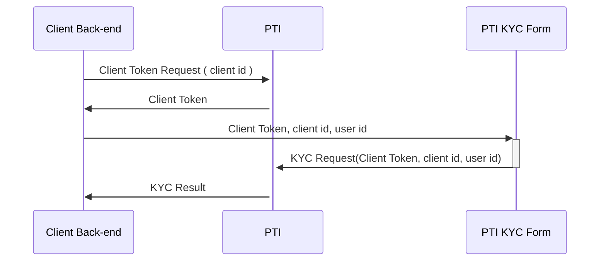

## Client-side integration
### Client-side flow
Here is an example of a flow that would occur if you use the PTI KYC form.



Basically, the only involvement that the client has here is to display the KYC form using the SDK, and expose an endpoint to generate the Client Token.

### Integrating the SDK
You should include and initialize the library from our CDN on your front end page. Normally there should only be one call to the `PTI.init` function.

```js
 <script async defer src="https://sdk.api$ENV.pticlient.com/0.0.11/index.js"></script>
    <script>
      window.ptiAsyncInit = function() {
        PTI.init({
          clientId: "$YOUR_CLIENT_ID",
          generateTokenPath: "$YOURPATH example /generateToken",
          sessionId: "$YOURSESSIONID"
        });
      }
    </script>
```

The `sessionId` parameter can be omitted (a random uuid will be generated by the SDK in that case), but that value will be used to group all the UI interactions which are monitored by the PTI SDK. Ideally, the client provides a value that will allow the association to all the session information kept on their end.


### SDK forms usage and examples

#### Display the KYC form

```js
 PTI.form({
        type: "KYC",
        requestId: requestId,
        userId: userId,
        metaInformation: {key:"value"},
        profileId: profileId,
        scenarioId: scenarioId,
        parentElement: document.getElementById(e.id),
        callback: callback
 });
```

#### Display the payment form

```js
  PTI.form({
      type: "FIAT_FUNDING",
      requestId: requestId,
      userId: userId,
      amount: amount,
      profileId: profileId,
      scenarioId: scenarioId,
      currency: currency,
      metaInformation: {key:"value"},
      statementMessage:statementMessage, 
      parentElement: document.getElementById(e.id),
      callback: callback
  })

```

Request id is something that needs to be provided as a header to any actions you take in the PTI system, this will be your reference for webhook feedbacks and API polling later on. We strongly suggest that you use **UUIDs**. Ideally, if you already have one on your side, you can use this one and it will make it easier to reference on your side as well.

### Reference React application example

Here is an example of a very simple React/Python app that does the whole flow

https://github.com/provenancetech/pti-docs/tree/master/examples/ReactJsSdkApp

The backend

https://github.com/provenancetech/pti-docs/tree/master/examples/PythonBackendApp 


## Server-side integration
### Generating user tokens from your backend
Here is an example, this endpoint will need to be secured by your app.

It will then be called by your front-end, via the SDK

```python
@app.route('/generateToken', methods=['POST'])
def generate_token():
    payload = request.get_json()
    json_data = json.dumps(payload['x-pti-token-payload'])
    response = make_signed_request(args.client_id, args.private_key, f'{args.pti_api_base_url}/auth/userToken',
                                   method="POST", data=json_data)
    return response.json()

```

### Creating your webhook
You need to expose an **HTTPS** endpoint that is accessible to us to get you API feedback.

It is **strongly recommended** that in addition to decrypting the message with your key, you also verify the included signature for all message incoming to you webhook, that way you prevent man in the middle attacks.

Here is an example that shows you how to do so(Python)

https://provenancetech.github.io/pti-docs/guide/v0/#/?id=example-webhook
