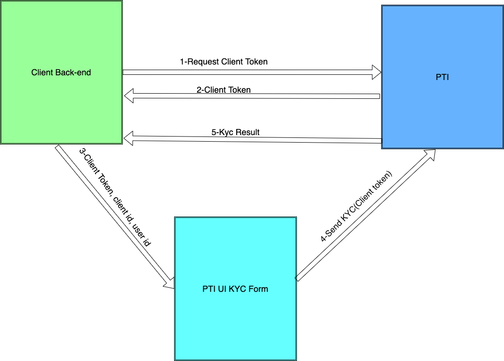

# PTI Integration guide

## Setting up your account
### Credentials generation
Contact the PTI team, you will be issued a private key in the JWK format.

**You, as the customer, are responsible for the security of this private key.**

You also will be issued a customer id, that will be necessary to interact with the API.

### Authenticating with the API
There is two way to authenticate with the PTI system, either by signed requests or by using JWT tokens.

Making signed requests:

https://provenancetech.github.io/pti-docs/guide/v0/#/?id=making-signed-requests

Generate JWT tokens

https://provenancetech.github.io/pti-docs/guide/v0/#/?id=generating-a-single-use-jwt-with-permissions-for-a-specific-url


## Creating PTI Users
Prior to doing any actions on the API, you must define your users on the PTI system.

This can be done either from the front end or the backend. Typically, you could create PTI users as part of the same flow as your user creation process. It could be also done the first time they need to interact with PTI. Ideally, you should use an id that enables you to easily map this user with your own users.

Here is the call reference

https://provenancetech.github.io/pti-docs/api/v0/index.html#/paths/~1users/post

## Client-side integration
### Client-side flow
Here is an example of a flow that would occur if you use the PTI KYC form.

<div align=center>

</div>

Basically, the only involvement that the customer has here is to display the KYC form using the SDK, and expose an endpoint to generate the JWT token.

### Integrating the SDK
You should include and initialize the library from our CDN on your front end page.

```js
 <script async defer src="https://sdk.api$ENV.pticlient.com/0.0.10/index.js"></script>
    <script>
      window.ptiAsyncInit = function() {
        PTI.init({
          clientId: "$YOUR_CLIENT_ID",
          generateTokenPath: "$YOURPATH example /generateToken"
        });
      }
    </script>
```

### SDK forms usage and examples 
How to display a KYC form

```js
 PTI.form({
        type: "KYC",
        requestId: requestId,
        userId: userId,
        metaInformation: {key:"value"},
        profileId: profileId,
        scenarioId: scenarioId,
        parentElement: document.getElementById(e.id),
        callback: callback
 });
```

How to display a Payment form

```js
  PTI.form({
      type: "FIAT_FUNDING",
      requestId: requestId,
      userId: userId,
      amount: amount,
      profileId: profileId,
      scenarioId: scenarioId,
      currency: currency,
      metaInformation: {key:"value"},
      statementMessage:statementMessage, 
      parentElement: document.getElementById(e.id),
      callback: callback
  })

```

Request id is something that needs to be provided as a header to any actions you take in the PTI system, this will be your reference for webhook feedbacks and API polling later on. We strongly suggest that you use **UUIDs**. Ideally, if you already have one on your side, you can use this one and it will make it easier to reference on your side as well.

### Reference React application example

Here is an example of a very simple React/Python app that does the whole flow

https://github.com/provenancetech/pti-docs/tree/master/examples/ReactJsSdkApp 

The backend

https://github.com/provenancetech/pti-docs/tree/master/examples/PythonBackendApp 

## Server-side integration
### Generating user tokens from your backend
Here is an example, this endpoint will need to be secured by your app.

It will then be called by your front-end, via the SDK

```python
@app.route('/generateToken', methods=['POST'])
def generate_token():
    payload = request.get_json()
    json_data = json.dumps(payload['x-pti-token-payload'])
    response = make_signed_request(args.client_id, args.private_key, f'{args.pti_api_base_url}/auth/userToken',
                                   method="POST", data=json_data)
    return response.json()

```

### Creating your webhook
You need to expose an **HTTPS** endpoint that is accessible to us to get you API feedback.

It is **strongly recommended** that in addition to decrypting the message with your key, you also verify the included signature for all message incoming to you webhook, that way you prevent man in the middle attacks.

Here is an example that shows you how to do so(Python)

https://provenancetech.github.io/pti-docs/guide/v0/#/?id=example-webhook

### Webhook Responses definitions
Here is what you can receive on your webhook:

KYC Result

```json
{
   "resourceType":"KYC",
   "requestId":"$YOUR_REQUEST_ID",
   "clientId":"$YOUR_CLIENT_ID",
   "userId":"$YOUR_USER_ID",
   "status":"ACCEPTED/REFUSED/UNDER_REVIEW/ERROR/PENDING",
   "tier": "Integer"
}
```

Transaction monitoring 

```json
{
   "resourceType":"TRANSACTION_MONITORING",
   "requestId":"$YOUR_REQUEST_ID",
   "clientId":"$YOUR_CLIENT_ID",
   "userId":"$YOUR_USER_ID",
   "status":"ACCEPT/MANUAL_REVIEW/DENY/ERROR/PENDING",
   "transactionDate":"iso8601 date",
   "amount":"$TRANSACTION_AMOUNT",
   "transactionType":"FUNDING, WITHDRAWAL, TRANSFER",
   "transactionMonitoringResultDetail":{
     "complianceProviderResponseCode" : "FRAUD_SUSPICION, TRANSACTION_VELOCITY_VIOLATION, BLOCKED_JURISDICTION, GEO_FENCING_VIOLATION, SANCTION_SCREENING"
   }
}
```

Payment processing

```json
{
   "resourceType":"PAYMENT_PROCESSOR",
   "requestId":"$YOUR_REQUEST_ID",
   "clientId":"$YOUR_CLIENT_ID",
   "userId":"$YOUR_USER_ID",
   "status":"AUTHORIZED/REFUSED/ERROR/PENDING",
   "date":"iso8601 date",
   "amount":"$TRANSACTION_AMOUNT",
   "fees": "$TRANSACTION_FEES",
   "currency":"$TRANSACTION_CURRENCY",
   "transactionType":"FUNDING, WITHDRAWAL, TRANSFER",
   "paymentMethod":"PAYPAL, TOKEN, BANK_ACCOUNT, ENCRYPTED_CREDIT_CARD",
   "additionalInfos" {
      "CreditCardLast4Digits":"XXXX",
      "PaymentProviderTransactionId":"XXXX"
   },
   "transactionStatusDetail": {
      "providerResponseCode":"PTI_TECHNICAL_ERROR, PAYMENT_PROVIDER_TECHNICAL_ERROR, 
      FRAUD_SUSPICION, BLOCKED_COUNTRY, AVS_CHECK_FAILED, 
      CVV_CHECK_FAILED, PAYMENT_INSTRUMENT_PROBLEM, PAYMENT_PROVIDER_DECLINED",
      "providerResponseCategory":"ERROR, SOFT_DECLINE, HARD_DECLINE"
   }
}
```

Payment processing subsequent update

```json
{
   "resourceType":"PAYMENT_PROCESSOR",
   "requestId":"$YOUR_REQUEST_ID",
   "clientId":"$YOUR_CLIENT_ID",
   "userId":"$YOUR_USER_ID",
   "status":"AUTHORIZED/REFUSED/ERROR/CHARGED_BACK/CANCELED/REFUNDED/CAPTURED/SETTLED",
   "date":"iso8601 date",
   "amount":"$TRANSACTION_AMOUNT",
   "fees": "$TRANSACTION_FEES",
   "currency":"$TRANSACTION_CURRENCY",
   "transactionType":"FUNDING, WITHDRAWAL, TRANSFER"
   "paymentMethod":"PAYPAL, TOKEN, BANK_ACCOUNT, ENCRYPTED_CREDIT_CARD",
   "additionalInfos" {
      "CreditCardLast4Digits":"XXXX"
   },
   "transactionStatusDetail": {
      "providerResponseCode":"PTI_TECHNICAL_ERROR, PAYMENT_PROVIDER_TECHNICAL_ERROR, 
      FRAUD_SUSPICION, BLOCKED_COUNTRY, AVS_CHECK_FAILED, 
      CVV_CHECK_FAILED, PAYMENT_INSTRUMENT_PROBLEM, PAYMENT_PROVIDER_DECLINED",
      "providerResponseCategory":"ERROR, SOFT_DECLINE, HARD_DECLINE"
   }
}
```

## References API
Here are the most useful API endpoints

 

Create a user

https://provenancetech.github.io/pti-docs/api/v0/index.html#/paths/~1users/post

 

Create user token

https://provenancetech.github.io/pti-docs/api/v0/index.html#/paths/~1auth~1userToken/post

 

Get user KYC latest result

https://provenancetech.github.io/pti-docs/api/v0/index.html#/paths/~1users~1{userId}~1kyc/get

 

Log a transaction

https://provenancetech.github.io/pti-docs/api/v0/index.html#/paths/~1users~1{userId}~1transactionLogs/post

 

Get transaction log result

https://provenancetech.github.io/pti-docs/api/v0/index.html#/paths/~1users~1{userId}~1transactionLogs~1{requestId}/get

 

Fiat in call

https://provenancetech.github.io/pti-docs/api/v0/index.html#/paths/~1users~1{userId}~1transactions~1fiat~1funding/post

 

Start a KYC for a user

https://provenancetech.github.io/pti-docs/api/v0/index.html#/paths/~1users~1{userId}~1kyc/post
