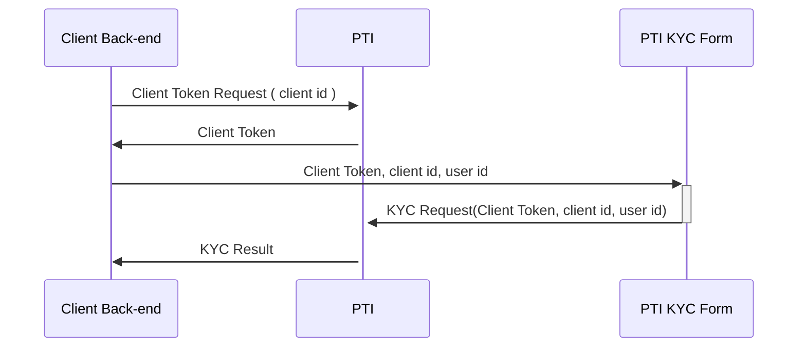

# PTI Integration guide

## Setting up your account
### Credentials generation
In order to obtain credentials necessary to interact with the PTI API, you need to contact the PTI team.

You will be issued a private key in the JWK format as well as a client id. Both will be necessary to interact with the API.

**You, as the customer, are responsible for the security of the private key.**


### Authenticating with the API
There are two ways to authenticate with the PTI system, either [by signed requests](https://provenancetech.github.io/pti-docs/guide/v0/#/?id=making-signed-requests) or
[by using JWT tokens](https://provenancetech.github.io/pti-docs/guide/v0/#/?id=generating-a-single-use-jwt-with-permissions-for-a-specific-url).

## Creating PTI Users
Prior to doing any actions on the API, you must define your users on the PTI system.

This can be done either from the front end or the backend. Typically, you could create PTI users as part of the same flow as your user creation process. It could be also done the first time they need to interact with PTI. Ideally, you should use an id that enables you to easily map this user with your own users.

Here is the call reference

https://provenancetech.github.io/pti-docs/api/v0/index.html#/paths/~1users/post

## Client-side integration
### Client-side flow
Here is an example of a flow that would occur if you use the PTI KYC form.



Basically, the only involvement that the client has here is to display the KYC form using the SDK, and expose an endpoint to generate the Client Token.

### Integrating the SDK
You should include and initialize the library from our CDN on your front end page. Normally there should only be one call to the `PTI.init` function.

```js
 <script async defer src="https://sdk.api$ENV.pticlient.com/0.0.11/index.js"></script>
    <script>
      window.ptiAsyncInit = function() {
        PTI.init({
          clientId: "$YOUR_CLIENT_ID",
          generateTokenPath: "$YOURPATH example /generateToken",
          sessionId: "$YOURSESSIONID"
        });
      }
    </script>
```

The `sessionId` parameter can be omitted (a random uuid will be generated by the SDK in that case), but that value will be used to group all the UI interactions which are monitored by the PTI SDK. Ideally, the client provides a value that will allow the association to all the session information kept on their end.


### SDK forms usage and examples 

#### Display the KYC form

```js
 PTI.form({
        type: "KYC",
        requestId: requestId,
        userId: userId,
        metaInformation: {key:"value"},
        profileId: profileId,
        scenarioId: scenarioId,
        parentElement: document.getElementById(e.id),
        callback: callback
 });
```

#### Display the payment form

```js
  PTI.form({
      type: "FIAT_FUNDING",
      requestId: requestId,
      userId: userId,
      amount: amount,
      profileId: profileId,
      scenarioId: scenarioId,
      currency: currency,
      metaInformation: {key:"value"},
      statementMessage:statementMessage, 
      parentElement: document.getElementById(e.id),
      callback: callback
  })

```

Request id is something that needs to be provided as a header to any actions you take in the PTI system, this will be your reference for webhook feedbacks and API polling later on. We strongly suggest that you use **UUIDs**. Ideally, if you already have one on your side, you can use this one and it will make it easier to reference on your side as well.

### Reference React application example

Here is an example of a very simple React/Python app that does the whole flow

https://github.com/provenancetech/pti-docs/tree/master/examples/ReactJsSdkApp 

The backend

https://github.com/provenancetech/pti-docs/tree/master/examples/PythonBackendApp 

## Server-side integration
### Generating user tokens from your backend
Here is an example, this endpoint will need to be secured by your app.

It will then be called by your front-end, via the SDK

```python
@app.route('/generateToken', methods=['POST'])
def generate_token():
    payload = request.get_json()
    json_data = json.dumps(payload['x-pti-token-payload'])
    response = make_signed_request(args.client_id, args.private_key, f'{args.pti_api_base_url}/auth/userToken',
                                   method="POST", data=json_data)
    return response.json()

```

### Creating your webhook
You need to expose an **HTTPS** endpoint that is accessible to us to get you API feedback.

It is **strongly recommended** that in addition to decrypting the message with your key, you also verify the included signature for all message incoming to you webhook, that way you prevent man in the middle attacks.

Here is an example that shows you how to do so(Python)

https://provenancetech.github.io/pti-docs/guide/v0/#/?id=example-webhook

### Webhook Responses definitions
Here is what you can receive on your webhook:

#### KYC Result

```json
{
   "resourceType":"KYC",
   "requestId":"$YOUR_REQUEST_ID",
   "clientId":"$YOUR_CLIENT_ID",
   "userId":"$YOUR_USER_ID",
   "status":"ACCEPTED/REFUSED/UNDER_REVIEW/ERROR/PENDING",
   "tier": "Integer"
}
```

#### Transaction monitoring 

```json
{
   "resourceType":"TRANSACTION_MONITORING",
   "requestId":"$YOUR_REQUEST_ID",
   "clientId":"$YOUR_CLIENT_ID",
   "userId":"$YOUR_USER_ID",
   "status":"ACCEPT/MANUAL_REVIEW/DENY/ERROR/PENDING",
   "transactionDate":"iso8601 date",
   "amount":"$TRANSACTION_AMOUNT",
   "transactionType":"FUNDING, WITHDRAWAL, TRANSFER",
   "transactionMonitoringResultDetail":{
     "complianceProviderResponseCode" : "FRAUD_SUSPICION, TRANSACTION_VELOCITY_VIOLATION, BLOCKED_JURISDICTION, GEO_FENCING_VIOLATION, SANCTION_SCREENING"
   }
}
```

#### Payment processing

```json
{
   "resourceType":"PAYMENT_PROCESSOR",
   "requestId":"$YOUR_REQUEST_ID",
   "clientId":"$YOUR_CLIENT_ID",
   "userId":"$YOUR_USER_ID",
   "status":"AUTHORIZED/REFUSED/ERROR/PENDING",
   "date":"iso8601 date",
   "amount":"$TRANSACTION_AMOUNT",
   "fees": "$TRANSACTION_FEES",
   "currency":"$TRANSACTION_CURRENCY",
   "transactionType":"FUNDING, WITHDRAWAL, TRANSFER",
   "paymentMethod":"PAYPAL, TOKEN, BANK_ACCOUNT, ENCRYPTED_CREDIT_CARD",
   "additionalInfos" {
      "CreditCardLast4Digits":"XXXX",
      "PaymentProviderTransactionId":"XXXX"
   },
   "transactionStatusDetail": {
      "providerResponseCode":"PTI_TECHNICAL_ERROR, PAYMENT_PROVIDER_TECHNICAL_ERROR, 
      FRAUD_SUSPICION, BLOCKED_COUNTRY, AVS_CHECK_FAILED, 
      CVV_CHECK_FAILED, PAYMENT_INSTRUMENT_PROBLEM, PAYMENT_PROVIDER_DECLINED",
      "providerResponseCategory":"ERROR, SOFT_DECLINE, HARD_DECLINE"
   }
}
```

#### Payment processing subsequent update

```json
{
   "resourceType":"PAYMENT_PROCESSOR",
   "requestId":"$YOUR_REQUEST_ID",
   "clientId":"$YOUR_CLIENT_ID",
   "userId":"$YOUR_USER_ID",
   "status":"AUTHORIZED/REFUSED/ERROR/CHARGED_BACK/CANCELED/REFUNDED/CAPTURED/SETTLED",
   "date":"iso8601 date",
   "amount":"$TRANSACTION_AMOUNT",
   "fees": "$TRANSACTION_FEES",
   "currency":"$TRANSACTION_CURRENCY",
   "transactionType":"FUNDING, WITHDRAWAL, TRANSFER"
   "paymentMethod":"PAYPAL, TOKEN, BANK_ACCOUNT, ENCRYPTED_CREDIT_CARD",
   "additionalInfos" {
      "CreditCardLast4Digits":"XXXX"
   },
   "transactionStatusDetail": {
      "providerResponseCode":"PTI_TECHNICAL_ERROR, PAYMENT_PROVIDER_TECHNICAL_ERROR, 
      FRAUD_SUSPICION, BLOCKED_COUNTRY, AVS_CHECK_FAILED, 
      CVV_CHECK_FAILED, PAYMENT_INSTRUMENT_PROBLEM, PAYMENT_PROVIDER_DECLINED",
      "providerResponseCategory":"ERROR, SOFT_DECLINE, HARD_DECLINE"
   }
}
```

## API Usage

The API reference documentation can be found [here](https://provenancetech.github.io/pti-docs/api/v0)

### Create a user and initiate a KYC
    
 * Post to the [create user endpoint](https://provenancetech.github.io/pti-docs/api/v0/index.html#/default/post_users) with the user ID of your choice.
 * Post to the [start KYC endpoint](https://provenancetech.github.io/pti-docs/api/v0/index.html#/default/post_users__userId__kyc) using the user ID you selected in the previous call.
 * Wait for the [KYC result](#kyc-result) to come back on your webhook and react according to the status received
 * 


### Log a transaction, get the transaction details and provide feedback

 * Post to the [log transaction endpoint](https://provenancetech.github.io/pti-docs/api/v0/index.html#/default/post_users__userId__transactionLogs) with the user ID originating the transaction as well as a request ID that needs to be stored for future reference to the transaction
 * Wait for the [transaction monitoring result](#transaction-monitoring) on your webhook, and react on the status received
 * Get the all the details about the transaction using the [get transcation endpoint](https://provenancetech.github.io/pti-docs/api/v0/index.html#/default/get_users__userId__transactions__requestId_) with the request ID used for the log transaction step above
 * Provide feedback on the transaction once all the operations on your side have completed using the [transaction feedback endpoint](https://provenancetech.github.io/pti-docs/api/v0/index.html#/default/post_transactions__requestId__feedback) using the request ID used in the first API call


### Perform a fiat funding

* Post to the [fiat funding endpoint](https://provenancetech.github.io/pti-docs/api/v0/index.html#/default/post_users__userId__transactions_fiat_funding) with the user ID for which you want to fund the account. You also need to pass in a request ID that needs to be stored for future reference to the transaction
* Wait for the [payment processing result](#payment-processing) on your webhook and react on the satus received

The fiat funding leverages the transaction monitoring feature as well as a payment processor connected to PTI. The SDK payment form calls the fiat funding endpoint under the hood.
