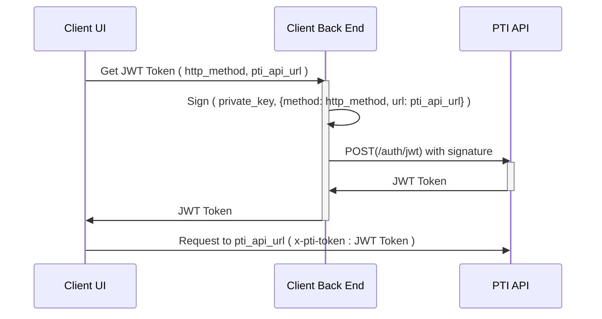

# Authentication

The PTI API uses asymmetric cryptography, encapsulated in a signature, to authenticate the caller of the API.
PTI only has access to your public key(s), never to your private key. It's your responsibility to keep your private key secure at all times.
Having access to your private key means having access to your PTI API account. 
Do **NOT** share your private key  in publicly accessible areas such as code repositories, client-side code, and so forth.

All API requests must be made over HTTPS. Calls made over plain HTTP will fail. API requests without authentication will also fail.

There are two authentication mechanisms to make api requests:

* Signed requests
* Single use authorization tokens

## Signed requests

Signed requests requires access to the private key to sign the request, so it is only possible to use this method when the API calls
are made from a private client. Only your server backend should make signed requests.

#### Making signed requests

Once you have completed the steps in the [onboarding guide](onboarding.md) and have your client ID and private key on hand, you can make requests to the PTI API. 

To make a signed request to the PTI API, you must include at least the two following headers:
- `x-pti-client-id` with the value set to your client ID
- `x-pti-signature` with the value set to the compact form of a JSON Web Signature (JWS)

The payload to sign must observe the following structure:
```
${HTTP-Verb of request}
${SHA256 of request body}
${Content Type}
date:${Current Date}
x-pti-client-id:${Your client ID}
${Endpoint URL of the request}
```

Note that the carriage returns `\n` in the payload must be present

Your private key is used to sign the Payload; the result of this is a JWS structure. The compact form of this structure is used as the `x-pti-signature` header content.

For example, for a POST request to `/v1/users` with a body of `{"name": "Jane Doe", "id": "my_internal_id-12345678"}`, the content of the payload to sign would be:

```
POST
63E6F62C55553EA2AEC0DE86662A22A7
content-type:application/json
date:Wed, 15 Apr 2020 16:35:50 GMT
x-pti-client-id:00000000-0000-0000-0000-000000000000
/v1/users
```

Once signed using JWS (compact form), you get:

```
eyJhbGciOiJFZERTQSIsImNpZCI6IjAwMDAwMDAwLTAwMDAtMDAwMC0wMDAwLTAwMDAwMDAwMDAwMCIsImNydiI6IkVkMjU1MTkiLCJraWQiOiJLWHk0SU1idEhpaXJQN2tBQXdFOXFydVQwejlNUEx3MUlCUER5dmNja3VrIn0.UE9TVAo2M0U2RjYyQzU1NTUzRUEyQUVDMERFODY2NjJBMjJBNwpjb250ZW50LXR5cGU6YXBwbGljYXRpb24vanNvbgpkYXRlOldlZCwgMTUgQXByIDIwMjAgMTY6MzU6NTAgR01UCngtcHRpLWNsaWVudC1pZDowMDAwMDAwMC0wMDAwLTAwMDAtMDAwMC0wMDAwMDAwMDAwMDAKL3YwL3VzZXJz.CDfqOdRglnxdjBjPAow7dpX6um6bSXvJGEBeICl3VVQi1ERfstMgRlWP67YiAyLy04pqNnkMjO_DNNefKpGnBQ
```

You would then include the JWS as your Signature in the `x-pti-signature` http header of your request. You also need to include a `x-pti-client-id` http header containing your PTI Client ID.

The payload to sign for a GET request to `/v1/users/00000000-0000-0000-0000-000000000000` would look like:

```
GET


date:Wed, 15 Apr 2020 16:35:50 GMT
x-pti-client-id:00000000-0000-0000-0000-000000000000
/v1/users/00000000-0000-0000-0000-000000000000
```

Note that for a GET request, `${SHA256 of request body}` and `${Content Type}` are empty, but the `\n` following them are still included. 

You must include `${SHA256 of request body}` and `${Content Type}` for POST, PATCH and PUT requests.

#### Helper tool to make signed requests

You can use the [signed_request_maker.py](https://github.com/provenancetech/pti-docs/blob/master/utils/signed_request_maker.py) utility to make signed requests to the PTI API. It's useful as a testing and learning tool for signed requests.

For example:

```shell
python signed_request_maker.py --clientId "00000000-0000-0000-0000-000000000000" --http-method 'POST' --data '{"name": "Jane Doe", "id": "my_internal_id-12345678"}' -k private_key.jwk --debug https//pti.apistaging.pticlient.com
```


## Single use tokens

If you need your users or third parties to be able to call the PTI API on your behalf, for example for uploading a PII, you can generate a single-use JWT (JSON Web Token) restricted to that specific operation. You can then hand the token to your user/third-party. Remember, it's your responsibility to keep the token secure, as it provides (restricted) access to your PTI account.

### Generating a single-use JWT with permissions for a specific URL

To generate a single-use token that can be used by one of your Users for a single request, you need to make a `POST` request to `/auth/jwt`. 
You need to specify the URL on which the token is to grant permission, eg, `{"url": "/transactions/deposit"}` and you will
receive a JSON response containing `{"accessToken": "..."}`. The value of the `accessToken` field has to be included in the `x-pti-token` HTTP Header in the request made by your User.

The call to the `/auth/jwt` endpoint must be done via a signed request, so this means that you will need to have an endpoint in your own backend to proxy the request that will generate the auth token.

The following diagram illustrates the token generation process leading to an API call with a single use token.


